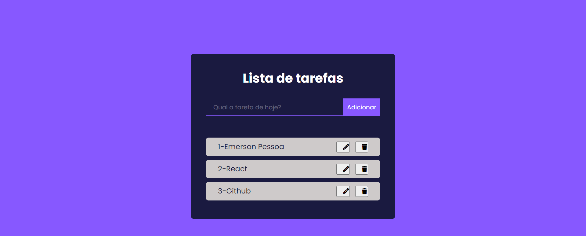

## Sobre o desafio todolist
	
O Todolist foi feito no Reactjs onde apresenta as funcionalidades do CRUD.

Conforme o desafio, possui o localStorage para armazenar os dados de entrada no navegador.

<p align="center">
  
</p>

# Instruções técnicas


### 1. Clone o repositório:
```bash
git clone https://github.com/emersonpessoa01/tasks
```

### 2. Instale as dependências e inicie o projeto

Acesse a pasta do projeto:
```bash
cd task
```

Instale as dependências do projeto:
```bash
yarn install
```

Inicie o projeto:
```bash
yarn dev
```

